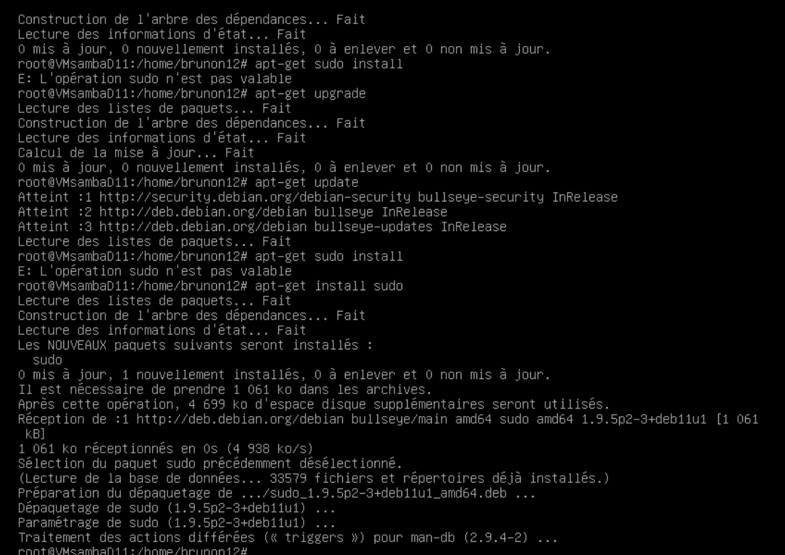

# TP SAMBA 
## création d'une nouvelle debian 
Dans l'interface vCenter,il faut sélectionnez l'option "Create a New Virtual Machine" et lui donner un nom *VM_D_Evan*
il faut choisir debian 11 (64 bits) et **selectionné linux** comme **systéme d'exploitation invité** puis il faut laisser par défaut les autres paramétres , il faut ensuite **modifier les paramétres** et mettre comme**périphérique fichier iso banque de donnée** et **forcé le démarrage** aprés il faut faire **remonter le cd room en premier pour démarrer l'ordinateur ,où se trouve l'iso**
ensuite il faut metrre un mot de passe et un identifiant.
il faut **désinstaller gnome pour avoir la debian sans interface graphique et l'environnement.** 

## Installation de samba
avant d'installer samba il faut installer les paquets **apt-get install,apt-get upgrade, apt-get install sudo**

aprés il faut faire sudo apt update puis 
