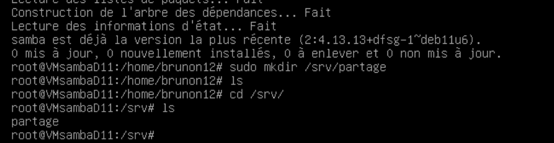

# TP SAMBA 
## création d'une nouvelle debian 
Dans l'interface vCenter,il faut sélectionnez l'option "Create a New Virtual Machine" et lui donner un nom *VM_D_Evan*
il faut choisir debian 11 (64 bits) et **selectionné linux** comme **systéme d'exploitation invité** puis il faut laisser par défaut les autres paramétres , il faut ensuite **modifier les paramétres** et mettre comme**périphérique fichier iso banque de donnée** et **forcé le démarrage** aprés il faut faire **remonter le cd room en premier pour démarrer l'ordinateur ,où se trouve l'iso**
ensuite il faut metrre un mot de passe et un identifiant.
il faut **désinstaller gnome pour avoir la debian sans interface graphique et l'environnement.** 

## Installation de samba
avant d'installer samba il faut installer les paquets **apt-get install,apt-get upgrade, apt-get install sudo**

aprés il faut faire sudo apt update puis il faut faire **sudo apt install samba -y** pour installer le serveur samba 

## Création du répertoire nommé partage dans le répertoire /srv/
tout d'abord il il faut utilisé la commande **sudo mkdir /srv/partage** pour créer le **répertoire partage dans /srv/**
pour voir si le répertoire partage à été créer il faut faire **ls**

## créer un groupe sambausers
pour créer un groupe sambausers,il faut faire **sudo groupadd sambausers**

## donner des droits au répertoire partage
Pour donner les droits 770 au répertoire /srv/partage il faut utiliser la commande **sudo chmod 770 /srv/partage**
les droits **770** signifie que **le propriétaire du répertoire a tous les droits (lecture, écriture, exécution)**,
**le groupe associé au répertoire a également tous les droits et les autres utilisateurs n'ont aucun droit d'accès**.
pour voir **vérifier les permissions** il faut faire **ls -ld /srv/partage**
cela doit nous afficher **drwxrwx--- 2 root sambausers 4096 Dec  5 14:33 /srv/partage**

## Associer groupe sambausers en propriétaires du répertoire /srv/partage
Pour associer le groupe sambausers en propriétaires du répertoire /srv/partage,
on doit utiliser la commande **sudo chown :sambausers /srv/partage**
pour voir la modification il faut faire **ls -ld /srv/partage**

## Créer des utilisateurs et  les affecter au groupe sambausers (p.nom et un professeur)
pour cela il faut **d'abord créer l'utilisateur p.nom** avec la commande **sudo useradd p.nom -m**
et il faut lui attribuer un mot de passe donc il faut faire la commande **sudo passwd p.nom**

Aprés il faut créer l'utilisateur professeur donc il faut faire **sudo useradd professeur -m**,
il faut lui définir un mot de passe avec la commande **sudo passwd professeur**

ensuite il faut les **ajouter au groupe sambausers**, t'abord il faut ajouter l'utilisateur "p.nom" au groupe sambausers
avec la commande **sudo usermod -aG sambausers p.nom**
aprés il faut ajouter l'utilisateur "professeur" au groupe sambausers avec la commande **sudo usermod -aG sambausers professeur**, on vérifie que les utilisateurs sont bien ajoutés au groupe avec la commande **groups p.nom** et **groups professeur**

## Associer les à la base samba grâce à la commande smbpasswd
Pour les associers à la base samba il faut **créer leurs comptes Samba avec la commande smbpasswd**
tout d'abord il faut ajouter l'utilisateur p.nom à la base Samba et lui attribuer un mot de passe Samba 
avec la commande **sudo smbpasswd -a p.nom**
aprés il faut ajouter l'utilisateur professeur à la base Samba et lui attribuer un mot de passe Samba 
avec la commande **sudo smbpasswd -a professeur**

Pour vérifier que les utilisateurs ont été correctement ajoutés à la base Samba,on utilise la commande suivante 
**sudo pdbedit -L**

## configurer le fichier de configuration smb.conf
il faut ouvrir le fichier de configuration de Samba avec un éditeur de texte en mode super utilisateur en 
fesant **sudo nano /etc/samba/smb.conf**
ensuite il faut ajoutez la section suivante à la fin du fichier smb.conf. Cela configurera le partage Partage
donc il faut faire **path = /srv/partage
valid users = @sambusers
read only = yes
write list = p.nom**

il faut faire ctrl + O pour sauvegarder et entrer pour quitter.
## Redémarrer le service smbd
Pour redémarrer le service smbd il faut faire **sudo systemctl restart smbd**

**Le fichier de configuration smb.conf de Samba contient de nombreuses options qui définissent le comportement du serveur Samba. Il permet de configurer les partages, la sécurité, les utilisateurs, les groupes et d'autres paramètres réseau.**

##  Sur la machine Windows connecter votre lecteur réseau et essayer de vousconnecter avec votre compte.

il faut aller dans l'explorateur de fichier puis cliquer sur les ... et cliquer sur connecter un lecteur réseau aprés 
dans dossier il faut mettre **\\127.26.104.3\partage** et mettre le nom d'utilisateur et le mot de passe 

